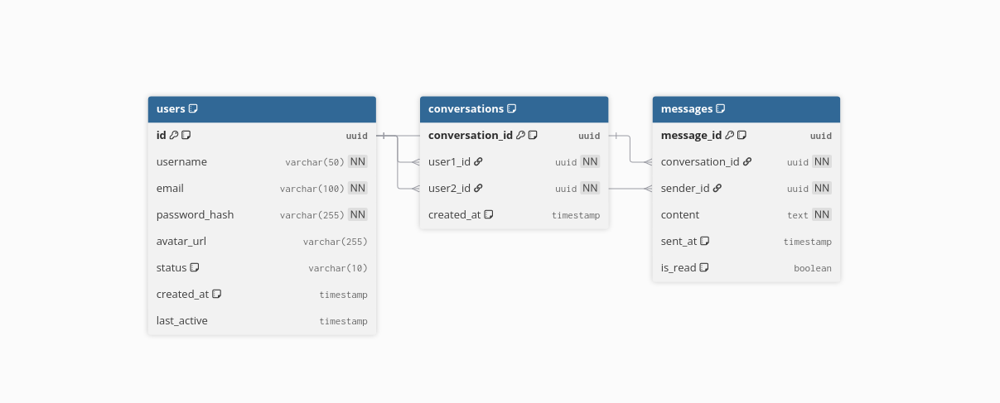

# Chat Application

A real-time chat application built with Java 21 and Spring Boot, featuring a microservices architecture with separate authentication and conversation services.

#### Note: This project is not completed yet....

## 🏗️ Architecture

This application follows a microservices architecture pattern with the following components:

- **Common Module**: Shared utilities, DTOs, and constants
- **Auth Service**: Handles user authentication, registration, and user management
- **Conversation Service**: Manages chat conversations and message handling

### Inter-Service Communication with Apache Kafka

The services communicate through Apache Kafka using a request-response pattern for synchronous communication between microservices:

- **Service Requests**: Auth service requests handled via Kafka topics
- **Message Processing**: Conversation service processes messages through Kafka queues
- **User Validation**: Real-time user authentication requests between services
- **Data Synchronization**: Cross-service data consistency through Kafka messaging

#### Kafka Topics for Request-Response

- `auth-requests`: Authentication and user validation requests
- `auth-responses`: Authentication responses and user data
- `message-requests`: Message processing and validation requests
- `message-responses`: Message processing results and confirmations

## 🛠️ Tech Stack

- **Java 21**
- **Spring Boot 3.x**
- **Spring Security** (for authentication)
- **Spring Data JPA** (for database operations)
- **PostgreSQL/MySQL** (database)
- **Gradle** (build tool)
- **Apache Kafka** (event streaming and message queuing)
- **Kubernetes** (container orchestration)
- **Docker** (containerization)

## 📊 Database Schema



## 🚀 Getting Started

### Prerequisites

- Java 21 or higher
- Gradle 8.x
- Docker and Docker Compose
- Kubernetes cluster (for production deployment)
- Apache Kafka (included in Docker Compose)
- PostgreSQL (if running locally without Docker)

### Installation

1. **Clone the repository**

   ```bash
   git clone <repository-url>
   cd chat-app
   ```

2. **Build the project**

   ```bash
   ./gradlew build
   ```

3. **Run with Docker Compose (includes Kafka)**

   ```bash
   docker-compose up -d
   ```

   This will start:

   - Zookeeper and Kafka cluster
   - Redis for caching
   - PostgreSQL databases
   - Auth and Conversation services

4. **Run Auth Service**

   ```bash
   cd services/auth-service
   ./gradlew bootRun
   ```

5. **Run Conversation Service**
   ```bash
   cd services/conversation-service
   ./gradlew bootRun
   ```

## ⚙️ Configuration

### Environment Variables

Create `.env` files for each service or set the following environment variables:

### Application Properties

Each service has its own `application.yml` or `application.properties` file in the `src/main/resources` directory.

## 🐳 Docker & Kubernetes Support

### Docker Architecture

The application uses a multi-container Docker architecture with the following components:

- **Service Containers**: Individual containers for each microservice
- **Database Containers**: PostgreSQL containers for each service
- **Kafka Container**: Apache Kafka for event streaming
- **Zookeeper Container**: Required for Kafka coordination
- **Redis Container**: For caching and session management

### Build and Run Commands

```bash
# Build all services
docker-compose build

# Run all services with Kafka
docker-compose up -d

# Scale specific services
docker-compose up -d --scale conversation-service=3

# View logs
docker-compose logs -f kafka
docker-compose logs -f auth-service

# Stop services
docker-compose down -v
```

### Individual Service Docker Commands

```bash
# Build services
docker build -t chat-auth-service ./services/auth-service
docker build -t chat-conversation-service ./services/conversation-service

# Run with Kafka network
docker network create chat-network
docker run -d --name kafka --network chat-network -p 9092:9092 confluentinc/cp-kafka
docker run -d --name auth-service --network chat-network -p 8081:8081 chat-auth-service
```

## ☸️ Kubernetes Deployment

### Kubernetes Architecture

The application is designed for Kubernetes deployment with the following resources:

#### Service Deployments

- **Auth Service**: 3 replicas with HPA (Horizontal Pod Autoscaler)
- **Conversation Service**: 5 replicas with HPA
- **Kafka Cluster**: 3-node Kafka cluster using Strimzi operator
- **Database**: PostgreSQL with persistent volumes

#### ConfigMaps and Secrets

- Database connection strings
- Kafka bootstrap servers
- JWT secrets and API keys
- Service discovery configurations

### Kubernetes Manifests

#### Distributed Tracing with Jaeger

- OpenTracing integration in Spring Boot services
- Request tracing across microservices
- Kafka message tracing
- Performance bottleneck identification

## 🔒 Security

- JWT-based authentication
- Password hashing with BCrypt
- CORS configuration for cross-origin requests
- Input validation and sanitization
- SQL injection prevention with JPA

## 🧪 Testing

Run tests for all modules:

```bash
./gradlew test
```

Run tests for specific service:

```bash
./gradlew :services:auth-service:test
./gradlew :services:conversation-service:test
```

## 📁 Project Structure

```
chat-app/
├── common/                          # Shared module
│   ├── src/main/java/com/example/common/
│   │   ├── constants/              # Application constants
│   │   └── dto/                    # Data Transfer Objects
│   └── build.gradle
├── services/
│   ├── auth-service/               # Authentication service
│   │   ├── src/main/java/
│   │   ├── src/main/resources/
│   │   ├── Dockerfile
│   │   └── build.gradle
│   └── conversation-service/       # Conversation service
│       ├── src/main/java/
│       ├── src/main/resources/
│       ├── Dockerfile
│       └── build.gradle
├── docker-compose.yml
├── settings.gradle
├── build.gradle
└── README.md
```

## 🤝 Contributing

1. Fork the repository
2. Create a feature branch (`git checkout -b feature/amazing-feature`)
3. Commit your changes (`git commit -m 'Add some amazing feature'`)
4. Push to the branch (`git push origin feature/amazing-feature`)
5. Open a Pull Request
